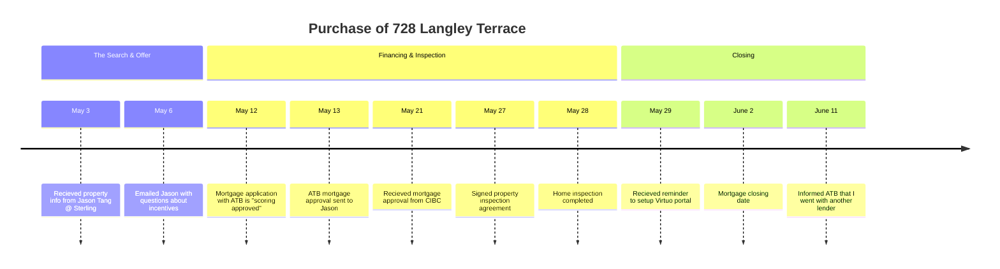

Welcome to the story of how we bought our new home in Lanark Landing. This page provides a high-level overview of our journey, from the initial search to finally getting the keys. It was a winding road, with unexpected challenges and important lessons learned along the way.

For those who want to dive deeper into specific events, we've linked to the detailed blog posts that capture the moments as they happened.

## The First Attempt: A Lesson in Due Diligence

Our journey began in late 2024 with a different builder. What started with excitement quickly became a lesson in the importance of asking questions and demanding clarity. We encountered a series of challenges, from a [refusal to provide a sample contract](/_grievances/asked-for-sample-terms-or-a-void-contract) to [misrepresentations about the property and its features](/_grievances/misrepresented-the-restrictive-covenants).

The process was fraught with communication issues and a lack of transparency. We documented our experience extensively, hoping to help others navigate similar situations:

*   [Second Meeting with Trish](/posts/2024-11-12-second-meeting-with-trish)
*   [Trish Refused to Provide Schedule C](/posts/2024-11-14-trish-refused-to-provide-schedule-c)
*   [A $600k Bath](/posts/2024-11-16-a-600k-bath)

Ultimately, a significant [discrepancy in the plot plan](/posts/2024-11-18-douglas-homes-plot-plan-conclusion) and the builder's unwillingness to provide a waiver led us to walk away from the deal. It was a difficult decision, but a necessary one. We learned a great deal from our conversations with the developer, [Melcor](/posts/2024-11-18-following-up-with-melcor), and the architectural consultants at [E2 and Associates](/posts/2024-11-18-contacting-e2-and-associates).

## A New Beginning: 728 Langley Terrace

In May of 2025, we started fresh. This time, we found a home that felt right: 728 Langley Terrace, built by Sterling Homes. The process was smoother, but still required careful navigation of the mortgage and closing process.

Here are the key milestones from this new chapter:

## What's Next

We are now looking forward to moving into our new home and starting the next chapter. We'll continue to document our journey, from setting up utilities to tackling new home projects. Thank you for following along!